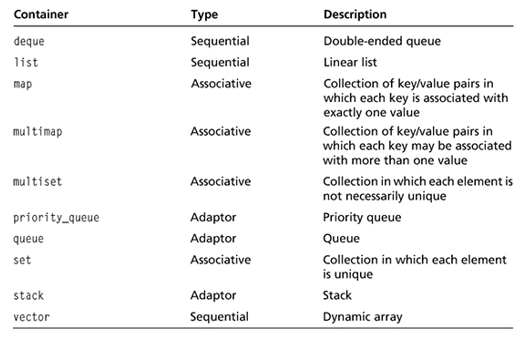

# CHPATER 4: THE STANDARD TEMPLATE LIBRARY: HANGMAN

## The standard template library

The *STL (Standard Template Library)* represents a powerful collection of programming work that’s been done well. It provides a group of containers, algorithms, and iterators, among other things.

*Containers* let you store and access collections of values of the same type. The STL defines a variety of container types; each works in a different way to meet different needs. The *algorithms* defined in the STL work with its containers (sorting, searching, copying, merging, inserting, and removing container elements). 
*Iterators* are objects that identify elements in containers and can be manipulated to move among elements.

## Using vectors

The **vector** class defines one kind of container provided by the STL. It meets the general description of a dynamic array—an array that can grow and shrink in size as needed.

- [hero_inventory_2.0](hero_inventory_2.0.cc)

## Using iterators

**Iterators** are values that identify a particular element in a container. Given an iterator, you can access the value of the element. Given the right kind of iterator, you can change the value. Iterators can also move among elements via familiar arithmetic operators.

A **constant iterator** is just like a regular iterator except that you can’t use it to change the element to which it refers

- [hero_inventory_3.0](hero_inventory_3.0.cc)

## Using algorithms

The STL defines a group of algorithms that allow you to manipulate elements in containers through iterators. Algorithms exist for common tasks such as searching, randomizing, and sorting.

- [high_scores](high_scores.cc)

## Vector performance

Although vectors grow dynamically as needed, every vector has a specific size. When a new element added to a vector pushes the vector beyond its current size, the computer reallocates memory and might even copy all of the vector elements to this newly seized chunk of memory real estate. This can cause a performance hit.

The **capacity()** vector member function returns the capacity of a vector—in other words, the number of elements that a vector can hold before a program must reallocate more memory for it. The capacity of a vector doubles every time a program reallocates additional memory for it.

- [vector_capacity](vector_capacity.cc)

The **reserve()** member function increases the capacity of a vector to the number supplied as an argument. Using reserve() gives you control over when a reallocation of additional memory occurs.

- [vector_reserve](vector_reserve.cc)

Adding or removing an element from the end of a vector using the push_back() or pop_back() member functions is extremely efficient. However, adding or removing an element at any other point in a vector (for example, using insert() or erase()) can require more work because you might have to move multiple elements to accommodate the insertion or deletion. Fortunately, the STL offers another sequence container type, **list**, which allows for efficient insertion and deletion regardless of the sequence size.

## Other STL containers

The STL defines a variety of container types that fall into two basic categories: **sequential** and **associative**. With a sequential container, you can retrieve values in sequence, while an associative container lets you retrieve values based on keys. Container **adaptors** represent standard computer science data structures. Although they are not official containers, they look and feel just like them. 

## Project

- [hangman](hangman.cc)

## Summary

- The Standard Template Library (STL) is a powerful collection of programming code that provides containers, algorithms, and iterators.
 - Containers are objects that let you store and access collections of values of the same type.
 - Algorithms defined in the STL can be used with their containers and provide common functions for working with groups of objects.
 - Iterators are objects that identify elements in containers and can be manipulated to move among elements.
 - Iterators are the key to using containers to their fullest. Many of the container member functions require iterators, and the STL algorithms require them too.
 - To get the value referenced by an iterator, you must dereference the iterator using the dereference operator (*).
 - A vector is one kind of sequential container provided by the STL. It acts like a dynamic array.
 - It’s very efficient to iterate through a vector. It’s also very efficient to insert or remove an element from the end of a vector.
 - It can be inefficient to insert or delete elements from the middle of a vector, especially if the vector is large.
 - Pseudocode, which falls somewhere between English and a programming language, is used to plan programs.
 - Stepwise refinement is a process used to rewrite pseudocode to make it ready for implementation.

## Exercises

- [game_library](game_library.cc)